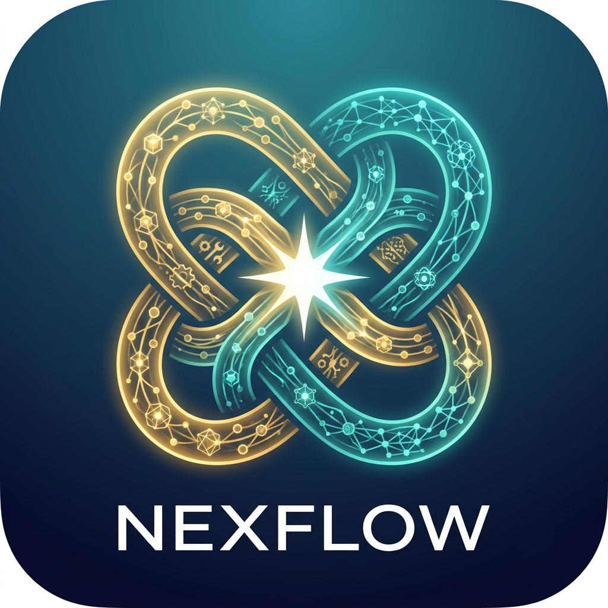

<p align="center">
  
</p>

<h1 align="center">Nexflow</h1>

<p align="center">
  <strong>Multi-Agent Management Console</strong> — a desktop app to design, manage, and chat with hierarchies of AI agents.
</p>

<p align="center">
  <a href="#features">Features</a> ·
  <a href="#tech-stack">Tech Stack</a> ·
  <a href="#getting-started">Getting Started</a> ·
  <a href="#project-structure">Project Structure</a>
</p>

---

## Overview

Nexflow is a Wails-based desktop application that lets you build **agent trees** — a root agent with ordered sub-agents that are delegated to autonomously at runtime via the Google **Agent Development Kit (ADK)**. Everything is managed from a local console UI:

- **Agents** — define root agents and sub-agents, set their mode (`chat`, `task`, `single_turn`), assign a model credential, and reorder children.
- **Models** — register model credentials (API keys + base URLs) for LLM providers (OpenAI, Anthropic, Google, Ollama, …) at `app` (shared) or `user` scope, stored in the local database.
- **Skills** — manage static skills (text or PDF) and attach them to agents for later use.
- **MCP** — manage Model Context Protocol server configs (`streamable_http` or `stdio`), optionally restrict them to an allow-list of tools, and link them to agents.
- **Chat** — start a session against any agent tree and watch events stream to the UI in real time, with run and session history persisted locally.

## Features

- **Hierarchical agents** — persistent, position-ordered agent trees; sub-agents are reorderable from the UI, and the saved order is preserved in the ADK sub-agent list built at run time.
- **ADK-powered runs** — a run invokes a root agent and ADK autonomously delegates to sub-agents based on instructions and descriptions; events, run status, and session state are persisted per invocation.
- **User-scoped resources** — model credentials and skills can be app-scoped (shared) or user-scoped; sessions belong to a user.
- **Human-in-the-loop** — a run can pause on an ADK tool-confirmation request and be resumed with an approve/reject decision.
- **Local-first** — runs on a local SQLite database with no external services (an optional Ollama container is included via `docker-compose`).

## Tech Stack

| Layer      | Technology                                                        |
|------------|--------------------------------------------------------------------|
| Desktop    | [Wails v2](https://wails.io) (Go + WebView2/WebKit)                 |
| Inference  | [Google ADK v2](https://google.github.io/adk-docs/) (`google.golang.org/adk/v2`) |
| Backend    | Go 1.26                                                           |
| Database   | SQLite (via `modernc.org/sqlite`), `golang-migrate` migrations    |
| Queries    | [sqlc](https://sqlc.dev) generated, type-safe query code           |
| Validation | `go-jsonschema` generated types from [`schema.json`](schema.json)   |
| Frontend   | Vanilla HTML/CSS/JS (no framework), Wails bindings                 |

## Getting Started

### Prerequisites

- Go 1.26+
- [Wails CLI](https://wails.io/docs/gettingstarted/installation) (`go tool wails`)
- (Optional) Docker for the [Ollama](https://ollama.com) model server

### Run in dev mode

```bash
make wails-dev
```

To talk to an agent:

1. In the **Models** view, add a model credential for your LLM provider (provider, model name, base URL, and API key).
2. In the **Agents** view, create an agent (or sub-agent) and assign it that model credential.
3. In the **Chat** view, start a new chat against the agent.

### Build a packaged macOS app

```bash
make wails-build   # produces cmd/app/build/bin/Nexflow.app
make wails-run     # launch the binary directly (skips the Gatekeeper check)
```

### Useful commands

```bash
make generate          # regenerate schema, sqlc, and mock code (after schema/migration/query changes)
make lint-backend      # golangci-lint
make test-backend      # lint + tests
```

## Project Structure

```
.
├── cmd/
│   └── app/                  # Wails desktop app
│       ├── main.go           # Wails entrypoint
│       └── frontend/         # Vanilla JS UI (agents, models, skills, mcp, chat views)
├── internal/
│   ├── application/          # App bindings exposed to the frontend
│   ├── runner/               # Chat orchestration over ADK (see runner/FLOW.md)
│   ├── agents/               # Agent tree services
│   ├── sessions/ events/     # Session store & event persistence
│   ├── agentskills/ skills/  # Skill management
│   ├── mcpserver/ agentmcp/  # MCP server configs & agent linking
│   ├── modelcredentials/     # LLM credential management
│   └── ...                   # users, runs, sessionstate, artifacts
├── migrations/               # SQL schema + custom ENUM types
├── sqls/                     # SQL queries consumed by sqlc
├── schema.json               # JSON schema used to generate Go request/response types
├── configs/                  # app config & secrets
└── Makefile                  # generate / lint / test / wails-dev / wails-build ...
```

## Architecture Notes

- The **chat flow** (session creation → run → streaming events) is documented in [`internal/runner/FLOW.md`](internal/runner/FLOW.md).
- Design recommendations and deferred work are in [`docs/RECOMMENDATIONS.md`](docs/RECOMMENDATIONS.md).
- The **database schema** and custom enum types are documented in [`migrations/README.md`](migrations/README.md).

## License

Copyright © 2026 Nexflow.