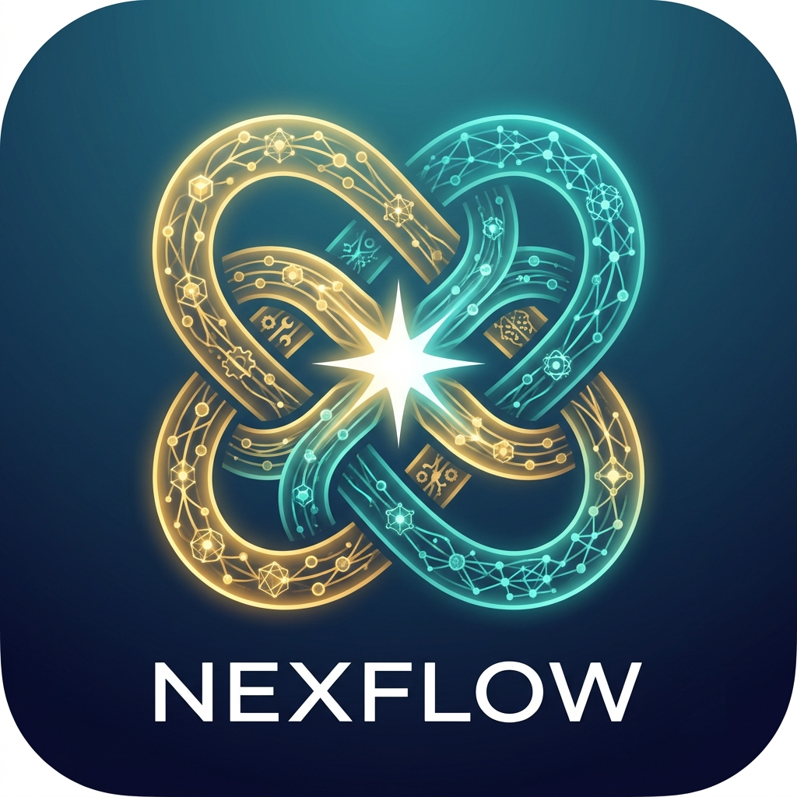
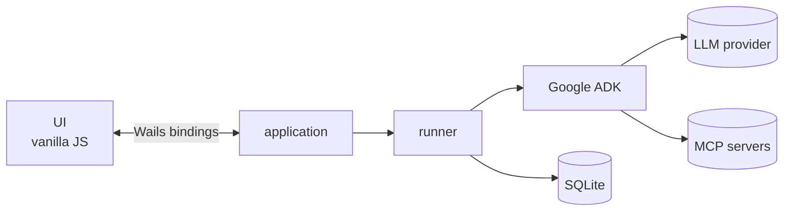

<p align="center">
  
</p>

<h1 align="center">Nexflow</h1>

<p align="center">
  <strong>A local-first desktop console to design, manage, and chat with hierarchies of AI agents.</strong>
</p>

<p align="center">
  <a href="https://github.com/spdeepak/Nexflow/actions/workflows/go.yml"></a>
  
  
  
</p>

<p align="center">
  <a href="#overview">Overview</a> ·
  <a href="#features">Features</a> ·
  <a href="#getting-started">Getting Started</a> ·
  <a href="#commands">Commands</a> ·
  <a href="#project-structure">Project Structure</a>
</p>

---

## Overview

Nexflow lets you assemble an **agent tree** — a root agent with ordered sub-agents — and chat with it from a desktop
UI. At run time the root agent is built with the [Google Agent Development Kit (ADK)](https://google.github.io/adk-docs/)
and delegates to sub-agents autonomously, following the instructions and descriptions you configured.

Everything lives on your machine: a SQLite database, locally stored credentials, and a vanilla HTML/CSS/JS frontend
talking to Go over [Wails](https://wails.io) bindings. No cloud account, no external service.


```mermaid
flowchart LR
    UI["UI<br/>vanilla JS"] <-->|Wails bindings| App["application"]
    App --> Runner["runner"]
    Runner --> ADK["Google ADK"]
    ADK --> Model[("LLM provider")]
    ADK --> MCP[("MCP servers")]
    Runner --> DB[("SQLite")]
```

## Features

- **Hierarchical agents** — build a root agent with ordered sub-agents, each with its own mode
  (`chat` / `task` / `single_turn`), instructions, model, skills, and MCP servers. Reordering children in the UI
  changes the order of the ADK `SubAgents` list at run time.
- **ADK-powered runs** — a run streams events back to the UI in real time and persists events, run status, tool
  calls, and session state per invocation.
- **Model credentials** — register provider + model + base URL + API key at `app` (shared) or `user` scope.
  Works with OpenAI, Anthropic, Google, Ollama, and any OpenAI-compatible endpoint.
- **Skills** — attach text/Markdown/CSV/JSON/PDF documents or a folder containing a `SKILL.md` file to an agent.
  Skills under `~/.agents/skills` are picked up automatically.
- **MCP servers** — configure `streamable_http` or `stdio` MCP servers, restrict them to an `allowed_tools`
  allow-list, and link them to agents. Bearer, API key, basic, and OAuth authentication are supported, with tokens
  stored locally.
- **Human-in-the-loop** — a run pauses on an ADK tool-confirmation request and resumes after you approve or reject
  it. Interrupted runs stay interrupted, never converted to failures.
- **Session & run history** — sessions, events, and runs are kept in SQLite and browsable from the UI.

> [!NOTE]
> Nexflow is a single-user, local-first app: your identity is derived from the machine and stored in the local
> database. Nothing is sent anywhere except the requests you configure to your own model and MCP providers.

## Getting Started

### Prerequisites

- [Go](https://go.dev/dl/) 1.26+
- A desktop OS with WebView support (macOS packaging scripts are included)
- (Optional) [Docker](https://www.docker.com) for the bundled Ollama service

The Wails CLI, sqlc, mockery, and golangci-lint are pinned as Go tool dependencies — `go tool <name>` fetches them
on first use, so there is nothing to install globally.

### Run in development mode

```bash
make wails-dev
```

> [!WARNING]
> `make wails-dev` deletes the local `app.db` and the generated Wails bindings before starting. Use it for a clean
> dev reset — back up the database first if you care about the data in it.

### Your first chat

1. **Models** — add a model credential: provider, model name, base URL, API key.
2. **Agents** — create a root agent, assign the credential, and optionally add sub-agents.
3. **Chat** — start a new session against that agent and send a message. Events stream into the UI as the run
   progresses.

### Run fully local with Ollama

Start the bundled Ollama container and pull a model into it:

```bash
docker compose up -d ollama
docker compose exec ollama ollama pull llama3.1
```

> [!TIP]
> Already running Ollama on your machine? Skip Docker and run `ollama pull llama3.1` directly instead.

Then add a model credential with provider `ollama` and base URL `http://localhost:11434/v1`.

### Build a packaged app

```bash
make wails-build   # produces cmd/app/build/bin/Nexflow.app
make wails-run     # launches the binary directly (skips the Gatekeeper check)
```

The bundle is ad-hoc signed; `make wails-run` starts the executable inside the `.app` so you do not need an Apple
Developer certificate.

## Commands

| Command                      | What it does                                        |
|------------------------------|-----------------------------------------------------|
| `make wails-dev`             | Reset the dev database and run the app with hot reload |
| `make wails-build`           | Build the packaged desktop app                       |
| `make wails-run`             | Launch the built app binary directly                 |
| `make generate`              | Regenerate sqlc queries and mockery mocks            |
| `make lint-backend`          | Run golangci-lint                                    |
| `make test-backend`          | Lint + run the Go test suite                         |
| `make test-backend-coverage` | Run tests and print filtered coverage                |
| `make mock-oauth`            | Start a local mock OAuth server for MCP testing      |

## Project Structure

```text
.
├── cmd/
│   ├── app/                  # Wails desktop entrypoint + frontend (agents, models, skills, mcp, chat views)
│   └── mock_oauth/           # Local mock OAuth server for MCP development
├── internal/
│   ├── application/          # Wails bindings exposed to the frontend
│   ├── runner/               # Chat orchestration over ADK (see runner/FLOW.md)
│   ├── agents/ agentskills/ agentmcp/   # Agent tree, skills, and MCP relationships
│   ├── mcpserver/ mcpstore/  # MCP server configs, OAuth tokens
│   ├── modelcredentials/     # LLM credential management
│   ├── sessions/ runs/ events/ toolcalls/ sessionstate/ artifacts/   # Run & event persistence
│   ├── skills/ device/ users/ oauth/ config/ db/                     # Supporting services
│   └── schema/ enums/ errors/ util/          # DTOs, validation, shared types
├── pkg/                      # logging, time
├── migrations/               # SQL schema (see migrations/README.md)
├── sqls/                     # Queries consumed by sqlc
├── configs/                  # App config and secrets
└── Makefile                  # generate / lint / test / wails-* targets
```

## Documentation

- [`internal/runner/FLOW.md`](internal/runner/FLOW.md) — the full chat flow, from the UI click to the persisted event.
- [`migrations/README.md`](migrations/README.md) — database schema and enum types.
- [`docs/RECOMMENDATIONS.md`](docs/RECOMMENDATIONS.md) — design decisions and deferred work.
- [`AGENTS.md`](AGENTS.md) — engineering conventions for this repository.
